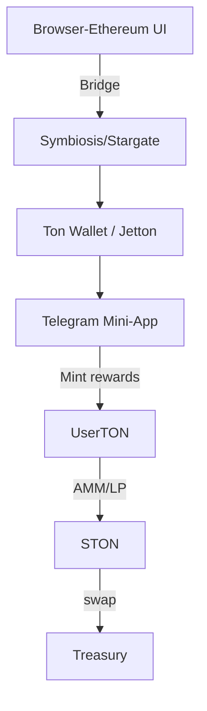

<!-- 
This document provides a comprehensive analysis of integrating TON's play-to-earn (P2E) ecosystem with Ethereum's environment. It explores the mechanics of P2E mining and farming on TON, strategies for bridging Telegram mini-apps with Ethereum-based browser applications, and detailed staking, liquidity, and fee-split models to ensure sustainable rewards for contributors while maintaining treasury value. Key highlights include:

1. Overview of TON's thriving P2E economy, DeFi stack, and NFT royalty mechanisms.
2. Explanation of reward issuance models, settlement cadence, and integration feasibility.
3. Detailed architecture for unified identity, bridging, and DeFi integration between TON and Ethereum.
4. Staking models, reward structures, and locking mechanisms to promote stability and long-term participation.
5. Discussion on the trade-offs of tradable NFTs and royalty models for treasury funding.
6. Concrete examples of fee and reward designs, including AMM swap fee splits, dual-incentive bootstrapping, and NFT sale surcharges.
7. User flow diagrams for Telegram mini-app interactions and bridging between Ethereum and TON.
8. Risk mitigation strategies for impermanent loss, speculation, regulatory compliance, and marketplace non-compliance.
9. Immediate action plan for prototyping, bridging, deploying AMM pools, implementing NFT policies, and enabling governance.

The document concludes with recommendations for leveraging TON's low fees, Telegram's reach, and Ethereum's governance capabilities to create a hybrid ecosystem that balances mass engagement with sustainable project economics.
-->
# TON P2E Research to brainstorm blending TON P2E w ETH environment

I researched TON’s play-to-earn (P2E) / Telegram mini-app ecosystem, TON DeFi, bridges, staking, and LP models. This report provides:

1. An explanation of how P2E mining and farming work on TON.
2. Guidance on integrating a Telegram mini-app with your browser/Ethereum experience.
3. Concrete staking, liquidity, and fee-split patterns to ensure contributors earn while the treasury captures value.

## Key Findings (TL;DR)

- **Thriving P2E Economy**: TON’s ecosystem supports popular Telegram mini-apps/games (e.g., Notcoin, Hamster Kombat, Flap-a-TON) that mint on-chain rewards and integrate with TON wallets and Jettons. These apps drive mass onboarding on TON.
- **DeFi Stack**: TON’s DeFi tools (STON.fi AMM, stTON, Symbiosis/Stargate bridges) enable seamless swaps, yield farming, and liquidity flows with low fees.
- **NFT Royalties**: TON’s NFT standards enforce royalties, enabling automatic treasury funding via marketplace surcharges.
- **Treasury Fee Splits**: Heavy splits (e.g., 80% treasury / 20% LP) are feasible but require compensating mechanisms (e.g., time-locked rewards) to attract liquidity.
- **Integration Feasibility**: Bridging funds between Ethereum and TON is practical, enabling a unified UX for Telegram mini-apps and browser apps.

---

## 1. How P2E Mining & Farming Work on TON

### A. Telegram Mini-Apps as the UX Gateway
- Mini-apps run inside Telegram webviews and are widely used for casual P2E games (e.g., Hamster Kombat, Notcoin).
- They mint Jetton rewards or points, invite wallet connections, and integrate payments.

### B. Reward Issuance Models
- **Tap-to-Earn**: Users earn points for daily actions, redeemable for Jettons or in-app use.
- **Farming via Staking/LP Deposits**: Users provide liquidity to AMMs (e.g., STON.fi pools) and stake LP tokens for rewards.
- **Event Drops & Airdrops**: Game events reward users with tokens tradable on DEXes.

### C. Settlement Cadence
- TON’s low fees enable frequent micro-rewards without heavy gas costs, making small, frequent claims viable.

---

## 2. Integrating a Telegram Mini-App with Ethereum/Browser Apps

### Architecture
- **Unified Identity**: Use the same DID (e.g., Ceramic/Soulbound NFTs) across web and Telegram.
- **Bridging & Funding**: Allow users to bridge ETH/USDC to TON Jettons via Symbiosis/Stargate.
- **Mini-App P2E Layer**: Mint Jetton rewards or off-chain points in the mini-app.
- **DeFi Integration**: Users can swap Jettons for project tokens or provide LP to STON.fi pools.
- **Exit Path**: Enable users to bridge Jettons back to Ethereum assets.

### UX Notes
- **Single Sign-On**: Use a “Link Telegram Account” button to connect sessions between web and mini-app.
- **Bridging UX**: Clearly explain bridging fees and time.
- **Gasless Micro-Rewards**: Use batch minting or off-chain accounting to reduce transaction overhead.

---

## 3. Staking, Rewards, and LPs

### Staking Models
- **Direct Validator Staking**: Stake Toncoin to earn network rewards.
- **Liquid Staking**: Use stTON tokens for liquidity while earning staking yields.
- **AMM LP & Farming**: Deposit token pairs to AMMs and stake LP tokens for rewards.

### How Contributors Benefit
- **Fee Share**: LPs earn swap fees; compensate for treasury-heavy splits with farming rewards.
- **Farming Rewards**: Mint additional tokens for stakers/LPs with vesting to align incentives.
- **Governance Perks**: Offer voting weight or exclusive perks to encourage long-term participation.

### Locking to Promote Stability
- **Time-Locks & Vesting**: Vest rewards over time to prevent short-term exits.
- **Lock Multipliers**: Reward longer locks with higher yields.
- **Slashing Penalties**: Optionally penalize early withdrawals to discourage quick exits.

---

## 4. Should Some NFTs Be Tradable?

### Pros
- Liquidity and discoverability.
- Royalties/surcharges fund the treasury.

### Cons
- Speculation may shift focus away from the mission.
- Risk of mercenary actors gaming incentives.

### Surcharge/Royalty Model
- Set on-chain royalties (e.g., 5–10%) to route to the treasury.
- Use tiered royalties: lower for common NFTs, higher for rare ones.

---

## 5. Concrete Fee & Reward Design Examples

### Example A: AMM Swap Fee Split
- **Total Fee**: 0.30%
  - LP Share: 0.06% (20%)
  - Treasury: 0.24% (80%)
- **Compensation**: Issue farming rewards to LPs.

### Example B: Dual-Incentive Bootstrap
- **Initial Fee Split**: 0.2% LP / 0.1% treasury for 30 days.
- **Farming Rewards**: Distribute 100,000 ETHO over 90 days with linear vesting.

### Example C: NFT Sale Surcharge
- **Royalty**: 7% (70% to treasury, 30% to creator/community pool).

---

## 6. Example User Flows & Diagrams

### A. User Plays in Telegram Mini-App
```mermaid
flowchart LR
  A[User plays mini-app] --> B(Earn points / Jettons)
  B --> C{On-chain mint?}
  C -->|Yes| D[Mint Jetton to user on TON]
  C -->|No| E[Off-chain ledger -> batch on-chain mint]
  D --> F[User uses Jetton: swap | LP | bridge out]
  F --> G[Swap on STON.fi -> fees -> LPs + Treasury]
  F --> H[Provide LP -> Earn fees & farming rewards]
```

### B. Bridge + Unified UX


---

## 7. Risks & Mitigations

- **Impermanent Loss**: Educate LPs and provide extra rewards for longer locks.
- **Speculation**: Use SBTs for governance and restrict certain NFTs as non-transferable.
- **Regulatory Compliance**: Consult legal counsel for fiat on/off-ramps.
- **Marketplace Non-Compliance**: Use TON’s royalty enforcement to prefer compliant marketplaces.

---

## 8. Recommended Immediate Action Plan

1. **Prototype Mini-App**: Build a basic Telegram mini-app with off-chain points and periodic on-chain minting.
2. **Bridge UX**: Integrate Symbiosis/Stargate for ETH-to-TON bridging.
3. **Deploy AMM Pool**: Create an ETHO ↔ PSD pool on STON.fi with initial farming incentives.
4. **NFT Policy**: Encode royalties in NFT contracts and decide tiered rates.
5. **Locking & Vesting**: Implement staking contracts with lock multipliers and vesting.
6. **Governance**: Publish fee split plans and enable DAO votes for parameter changes.

---

## Sources & Further Reading

- **TON Mini-Apps Overview**: [TON Developer Site](https://ton.org)
- **STON.fi AMM Docs**: [STON.fi](https://ston.fi)
- **Bridges to TON**: [Symbiosis](https://symbiosis.finance), [Stargate](https://stargate.finance)
- **TON Games & P2E Coverage**: [Bingx Exchange](https://bingx.com)
- **Yield Farming Guide**: [STON.fi Blog](https://ston.fi/blog)

---

## Final Thoughts

TON’s low fees, Telegram mini-app reach, and DeFi tools make it ideal for a hybrid approach: Ethereum for governance and TON for mass engagement. Carefully design fee splits and reward vesting to balance LP incentives with treasury sustainability. Use NFT royalties and staking locks to align the project with its mission.
