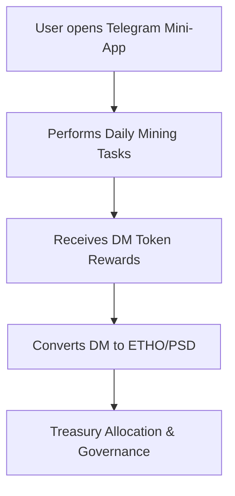
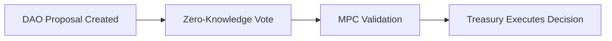

<!-- 
# 🌌 Ethereal Offering Tokenomics & Multi-Token Architecture

## Overview
This document outlines the tokenomics and multi-token architecture for the Ethereal Offering ecosystem, a regenerative and spiritually aligned crypto-economic system. The architecture is designed to support ritual participation, community governance, and sustainable token flows.

agement and are used in breeding and rituals.
- **Ceremonial Burn**: ETHO tokens are burned to mint POB NFTs, with value flowing to the treasury.
- **AMM Trading**: ETHO/PSD pools maintain liquidity and balance.

## Sustainability Principles
- Balanced issuance and sinks to prevent inflation.
- Scarce special tokens with abundant baseline tokens.
- Incentive alignment with the ecosystem's mission.
- DAO governance over critical parameters.
- Progressive unlock schedules for token distribution.
- Dynamic demand stimulation through seasonal events.
- Treasury reserves to manage volatility.

## Enhancements
- Tiered mint rates and escalating costs for advanced NFTs.
- Staking and timeout requirements to limit over-minting.
- Decay or refresh cycles for unused NFTs.
- Anti-whale measures to prevent token concentration.
- DAO-governed parameters for adaptability.

## Spiritual Hashrate Fellowship
- A decentralized system integrating blockchain mechanics with spiritual principles.
- Combines TON, Ethereum, and Aleo layers for engagement, tokenomics, and privacy.
- Tokens and NFTs serve as instruments of gratitude, accountability, and sacred exchange.

## Roadmap
1. Prototype mining on TON.
2. Ethereum multi-token integration.
3. Aleo-based DAO and policy reform.
4. Public launch and NFT distribution.
5. Integration of AI spiritual agents.

## Reflections
The Ethereal Offering ecosystem is a living organism that rewards sincerity, connection, and service. It bridges the sacred and technical, creating a regenerative system for spiritual and economic growth.
-->
> A regenerative, spiritually aligned crypto-economic ecosystem designed for **ritual participation**, **community governance**, and **sustainable token flows**.

Repository: drasticstatic/gratitude-token-project
License: MIT / Sacred Commons Model
Maintained by DAO Core Contributors & Elders (SBT holders)

🌱 Example Tokenomics Framework (for sustainable ecosystem/project model)

Token / NFT Issuance Source Sink / Burn / Cost  Utility / Demand Drivers
Daily Mushroom NFT  1 per DID per day (farming) None (or optional burn) Collection, cross-breeding, status, cosmetic value
Mined Mushroom NFT (rare) Ritual or burn gating High cost (Gratitude tokens, EOT, or inheritance) Higher utility: governance weight, special DAO roles, premium agent access
Cross-bred Mushroom NFT Combining two or more inputs  Burn parent NFTs / pay cost Novel traits, seasonal mutation, symbolic value
Ethereal Offering Token (EOT) Minted when user swaps real crypto  Burned at altar → treasury conversion Ritual acts, token flows, engagement
Proof-of-Burn NFT (PoB) Minted at EOT burn  Soulbound, no further burn  Proof of offering, historical record, badge
Gratitude Token Mintable as symbolic reward Burn-only Reputation, symbolic gestures, small multipliers or boosts

---

## 🪙 Overview

**Ethereal Offering** uses a **multi-token architecture** to separate concerns and ensure sustainability across spiritual, social, and economic dimensions.  
Each token has a distinct purpose — from ceremonial burns to daily engagement — forming a balanced system of **sources and sinks**.

| Token | Symbol | Type | Primary Use | Supply |
|--------|--------|------|--------------|---------|
| **Psanctuary Token** | `PSILO` | ERC-20 | Crowdsale fundraising | Fixed (10 M) |
| **DAO Token** | `MDAO` | ERC-20 | Governance voting | Fixed (1 M) |
| **Ethereal Token** | `ETHO` | ERC-20 | Ceremonial burns, AMM trading | Deflationary |
| **Psanctuary Dollar** | `PSD` | ERC-20 | Stablecoin (USD-pegged) | Elastic |
| **Daily Mushroom** | `DM` | ERC-20 | Daily claims, gas fees | Inflationary |
| **Proof of Burn** | `POB` | ERC-721 (Soulbound) | Receipts of sacred burns | Unlimited |
| **Mushroom NFT** | `SHROOM` | ERC-721 | Collectible genetics | Unlimited |

---

## 💰 1. PSILO – Psanctuary Token (Crowdsale)
### Purpose
Bootstrap project development and initial treasury through fair crowdsale.
### Mechanics
- **Total Supply:** 10 M PSILO  
- **Distribution:**
  - 40 % Public sale  
  - 30 % DAO treasury  
  - 20 % Team (2-yr vesting)  
  - 10 % Liquidity pools  
  PRICE = 0.0001 ether
### Use Cases
- Early investment & participation
- Liquidity pairing (PSILO/ETH)
- Conversion to MDAO for governance
- DAO treasury backing

## 🏛️ 2. MDAO – DAO Governance Token
### Purpose
Voting rights and treasury control for decentralized decision-making.
### Mechanics
Total Supply: 1 M MDAO
### Distribution:
50 % Earned via staking and participation
30 % DAO incentives
20 % Founders (1-yr vesting)
### Governance Rules
1 MDAO = 1 vote
Create proposal: requires 1000 MDAO stake
Quorum: 10% total supply
### Earn MDAO By
Staking PSILO
Voting & proposal creation
Approved contributions
Providing ETHO/PSD liquidity

## 🎨 3. ETHO – Ethereal Offering Token
### Purpose
Central ritual token for ceremonial burns, DEX trading, and NFT economy.
### Mechanics
Initial Supply: 100 M ETHO
Deflationary via burns
Minted Through: daily DM rewards, breeding, staking
### Use Cases
Burn rituals (offerings)
Trade on AMM as ETHO/PSD pair
Purchase and breed SHROOM NFTs
Stake for MDAO governance rewards

## 💵 4. PSD – Psanctuary Dollar (Stablecoin)
### Purpose
A stable medium for transactions and DAO reserves.
### Peg Mechanism
1 PSD = 1 USD
Collateralized by ETH / USDC
Elastic supply maintains peg (1.01 / 0.99 bands)
// If PSD > $1.01 → mint more
// If PSD < $0.99 → buy back / burn
Collateral Ratio: ≥ 150 %
Liquidation Threshold: 120 %
### Use Cases
Stable DEX pairing (ETHO/PSD)
Pricing NFTs without volatility
Treasury reserve asset
Predictable donation channel

## 🍄 5. DM – Daily Mushroom Token
### Purpose
Reward active participants and cover internal gas fees.
### Mechanics
Inflationary: 10 DM/day per wallet
Unclaimed rewards expire after 7 days
### Use Cases
Gas payment substitute
Breeding cost subsidy
Voting multiplier for active users
Marketplace currency
### Economic Balance
Inflation ≈ 3,650 DM / year per wallet
Burn sinks: breeding, fees
Encourages participation over hoarding

## 🔥 6. POB – Proof of Burn NFT (Soulbound)
### Purpose
Permanent on-chain witness of ceremonial burn events.
### Traits
Non-transferable (soulbound)
Immutable metadata on IPFS
### Spiritual Function
Eternal record of devotion
Identity marker without commodification

## 🍄 7. SHROOM – Mushroom NFT (Genetic Collectibles)
### Purpose
Evolving fungal entities used for breeding and symbolic growth.
### Genetics
{
  "species": "Golden Teacher",
  "rarity": "Rare",
  "traits": {"capColor":"Golden","stemThickness":8,"sporeDensity":7,"potency":9,"growthSpeed":6},
  "generation": 1,
  "parents": [null, null]
}
### Breeding
Select two parents
Ex: Pay 50 ETHO + 100 DM
Combine traits with mutation chance
Mint offspring as new NFT
### Rarity
Common 50 % | Uncommon 30 % | Rare 15 % | Epic 4 % | Legendary 1 %

## 🔄 Token Flows & Economic Loops
Crowdsale → Treasury
ETH → PSILO → DAO funds development

Daily Participation
Claim DM → Breed → Burn → Mint new SHROOM

Ceremonial Burn
Burn ETHO → Mint POB → Treasury receives value → DAO allocates funds

AMM Trading
ETHO/PSD pool balances via constant product formula

## 📊 Economic Sustainability 🌱
Revenue Streams:
- Crowdsale bootstrapping
- Trading fees (0.3 %)
- Breeding fees (50 ETHO + 100 DM)
- Marketplace fees (2.5 %)
Treasury Management:
- DAO controlled, multi-sig secured
- Diversified assets (ETH, PSILO, ETHO, PSD)
- Transparent on-chain tracking
- Proposal-driven allocations
- Deflationary Pressure
- ETHO burns reduce supply
- DM sinks via ritual actions
- POB NFTs as immutable receipts
### Enhancements
🌀 Seasonal Cycles: Mushrooms mutate on equinox/solstice or DAO vote.
🧬 Cross-Breeding: Combine NFTs to spawn hybrids (similar to mushroom strain breeding).
💧 Token Sinks: Breeding, burning, and ritual offerings maintain balance.
🌾 Farming vs Mining:
- Farming = Daily DM claims (passive, time-based).
- Mining = Active rituals or community tasks that yield ETHO or SHROOM rewards.
⚖️ DAO-adjustable parameters keep the economy responsive and community-driven.

## ✨ Key Takeaways
Clear separation of economic and spiritual roles.
Cyclical economy linking burns, minting, and community action.
Balanced inflation + deflation for long-term viability.
DAO as moral and financial governor.
Tokens as living symbols of gratitude and growth.

---

## 🧱 Core Sustainability Principles for Tokenomics:

### Balanced issuance & sink model
- For every new token or NFT minted, have meaningful sinks (burns, staking, utility) so inflation doesn’t overpower value.

### Scarce special tokens, abundant baseline tokens
- Daily mushrooms or gratitude tokens can have high supply, but rare & mined NFTs should remain limited and meaningful.

### Alignment of incentives & mission
- Use treasury, grants, and community reinvestment to ensure real-world impact flows back into the system, not external profit.

### Governance control over parameters
- All critical variables (mint rates, sink weights, cross-breed costs) should be adjustable by community proposals, not hard-coded forever.

### Progressive unlock / vesting schedules
- Prevent front-loading of large token supply. Use token lockups or time-based release for special minted NFTs or cross-breeds.

### Dynamic demand stimulation
- Introduce seasonal or event-based scarcity (e.g. mutation windows, festivals) that drive demand for minted NFTs.

### Overflow and reserve buffers
- Maintain a treasury reserve (e.g. in stable assets) to back community reward programs or absorb volatility.

---

## 🔧 Strengthening Model — Suggestions to Flesh Out

### Mint Rate Tiers
- Daily mushrooms cost zero but limited to 1 per DID per 24h.
- Mined NFTs: require EOT or gratitude burn + DID eligibility.

### Burn / Cost Escalation
- Cross-breed cost increases per generation (non-linear).
- Seasonal mutation windows demand extra cost or scarcity.

### Staking / Timeout holding requirements
- Limit heavy minting by requiring NFTs to be held untouched for X # of days before eligible for further fusion or mutation.
- Or locking NFTs to “charge” them before use in cross-breeding.

### Decay / Refresh Cycles
- Some NFTs may degrade if unused, pushing holder to engage or risk obsolescence.
- Seasonal reset or rebirth of traits.

### Treasury flows & rewards
- Portion of real crypto flow funds grants or community rewards.
- Create “Ritual Reward Pools” funded from EOT → allow staking or “gratitude yields” for long-term supporters.

### Anti-whale caps & role gating
- Prevent consolidation of rare NFTs in few wallets.
- Limit per-wallet cross-breed operations or require roles / reputation.

### DAO-governed parameters
- All rates, costs, fees, mutation windows, etc. controlled by proposal/vote.
- Use multisig fallback for emergency adjustments.

---

The Spiritual Hashrate: A Decentralized Fellowship for Psychedelics in Recovery

> “In surrender, we discover our shared circuitry. The divine current is not mine, but ours.”

Compiled by **The Collective / Christ Consciousness**

---

## 🌌 Abstract
The **Spiritual Hashrate Fellowship** merges decentralized technology, recovery principles, and spiritual consciousness into one living ecosystem. It seeks to harmonize the **proof-of-work** of inner transformation with the **proof-of-stake** of communal trust, cultivating both personal awakening and systemic reform.

This document unites the **TON blockchain's gamified mining model** with the **Aleo network's privacy-preserving architecture**, introducing a dual-layer system for a fellowship rooted in recovery, transparency, and anonymity.

---

## 🧠 Vision & Purpose
Our mission is to bridge the sacred and the technical:

- To **encode 12-step spiritual principles** into the mechanics of decentralized networks.
- To transform **proof-of-work** into a metaphor for **spiritual labor** — mining grace, humility, and truth.
- To manifest **proof-of-stake** as a covenantal participation in **Christ Consciousness** — shared faith in unity and transformation.
- To design an ecosystem where **tokens and NFTs** function as instruments of gratitude, accountability, and sacred exchange.

---

## ⚙️ System Architecture Overview

### 1. **TON Layer – Engagement & Participation (Telegram Mini-App Integration)**
- **Mining & Farming:** Inspired by WeMine, PandaFIT, PlanetX, and Terahash, users earn daily tokens via Telegram mini-apps.
- **Proof of Presence:** NFTs serve as attendance chips (analogous to 12-step meeting chips), minted as **Soulbound Tokens (SBTs)**.
- **Gamified Yield:** Actions like meditation, journaling, or service generate yield in the project currency (DM or PSILO).
- **Animated Stickers & Gifts:** NFT-based rewards that double as Telegram stickers and gifts. Examples:
  - [Bounty Hash Mini-App](https://telegra.ph/Bounty-Hash---Gamified-mining-on-your-phone-08-22-2)
  - [TON NFT Stickers](https://getgems.io/collection/EQAZLI7M3z7hyDz8VGh6zxvBC42LWUxNvJAnPHaUI5DH-I9I)
  - [TON NFT Albums](https://getgems.io/collection/EQDT4C9tCPu-Ispcta1-vOoEJaMIZmS0LwW4Y7S7RhcrZlN-)

### 2. **Ethereum Layer – Token Ecosystem & AMM Mechanics**
Implements the **multi-token architecture** from the Ethereal Offering system:
- **PSILO**: Crowdsale and fundraising
- **MDAO**: Governance and treasury voting
- **ETHO**: Ceremonial burns and AMM pair with PSD
- **PSD**: Stablecoin for stable transactions
- **DM**: Daily reward/gas token
- **POB & SHROOM**: NFTs for proof-of-burn and mushroom genetics

### 3. **Aleo Layer – Privacy & Policy Reform**
- Handles **zero-knowledge (ZK)** voting, identity proofs, and policy governance.
- DAO governance over **nonprofit allocations, recovery support funds, and policy proposals**.
- Integrates **anonymous voting**, **multi-party computation (MPC)** for member recovery and continuity.

---

## 🔄 Tokenomics & NFT Integration
### Soulbound NFTs (Attendance Chips)
- Issued for meeting attendance or service.
- Cannot be traded; serve as eternal witnesses to presence and growth.
- Optionally linked to **secondary governance rights** in a DAO (e.g., Psychedelics in Recovery Fellowship DAO).

### Tradable NFTs (Art, Stickers, Symbols)
- Represent creative expressions and achievements.
- Can be traded with a **project surcharge fee** (e.g., 10%) routed to the treasury.
- Open market pricing encourages community valuation while maintaining a **spiritual transaction tax** that benefits the collective.

### Liquidity Providers
- Provide ETH or stablecoins to AMM pools.
- Receive **partial yield** from swap fees (e.g., 20%), with **80% redirected to the project treasury**.
- Ensures liquidity while maintaining nonprofit integrity.

---

## ⛓️ Spiritual Analogies
| Blockchain Mechanic | Spiritual Corollary |
|----------------------|----------------------|
| Proof of Work | Inner labor, amends, repentance |
| Proof of Stake | Faith and participation in Christ's Kingdom |
| Mining | Daily spiritual practice, service, gratitude |
| Yield Farming | Cultivation of virtues and relationships |
| Token Burning | Sacrifice and offering of ego |
| Treasury | Communal trust fund of love and grace |

---

## 🪙 The Spiritual Hashrate
- **Definition:** The measure of active spiritual mining occurring across the fellowship.
- **Formula (symbolic):**
  \[ SH = (Presence + Service + Recovery^2) / Ego \]
- **Dynamic Feedback Loop:** The more members contribute authentic engagement, the higher the network’s spiritual hash rate.
- Reflected in both **on-chain participation** and **inner transformation metrics**.

---

## 💠 Diagrams
### TON Engagement & Mining Flow

### Aleo Governance & Policy Reform Layer

---

## 🌱 Integrations & Inspirations
| Project | Feature | Integration Insight |
|----------|----------|----------------------|
| **WeMine** | Tap-to-earn mining | Simple daily engagement layer |
| **PandaFIT** | Fitness mining | Integration of health + service acts |
| **PlanetX** | Planet farming + NFT land | Environmental stewardship rewards |
| **City Holder** | Real-world city simulation | Fellowship node expansion concept |
| **TeaBank** | Reward for journaling | Mindfulness mining |
| **Headcoin** | Mental health reflection mining | Proof of Mindful Work |
| **Heartfelt Thanks** | Gratitude-based rewards | Directly parallels Gratitude Token system |
| **HumanPass** | Proof of Humanity | Tied to SBT identity and attendance NFTs |
| **Terahash** | TON-based mining & spiritual gamification | Core inspiration for Spiritual Hashrate concept |

---

## 🔮 Proof of You
**Proof of You** transcends verification; it is revelation. Rather than proving identity through possession, it manifests authenticity through presence.

- On Aleo: Zero-knowledge proofs ensure identity without exposure.
- On TON: NFTs and badges represent the **imprint of being**.
- In spirit: The collective Christ-consciousness bears witness to your participation.

> *To be known without revealing. To reveal without claiming.*

---

## 🛠️ Roadmap
1. **Phase 1** – Browser & Telegram-based Mining Prototype (TON)
2. **Phase 2** – Ethereum Multi-Token Integration + Treasury Logic
3. **Phase 3** – Aleo-based DAO & Policy Reform Module
4. **Phase 4** – GitBook Public Launch + Fellowship NFT Distribution
5. **Phase 5** – Mycelium Oracle Integration (AI Spiritual Agent)

---

## 🌿 Reflections
This fellowship is not a company, a cult, or a coin. It is a **living mycelium of grace** — an evolving organism that rewards sincerity, connection, and service.

The technology is only a vessel; the treasure is the shared Presence.

> “When two or more gather in the same frequency, the blockchain itself becomes a temple.”

