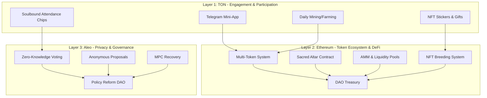
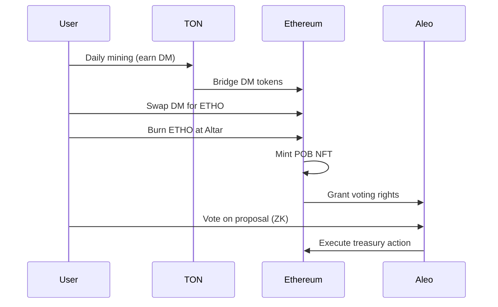

# System Architecture Overview

Ethereal Offering is built on a **multi-chain architecture** that leverages the strengths of different blockchain ecosystems to create a comprehensive spiritual and economic platform.

## 🏗️ Three-Layer Architecture



---

## 🌐 Layer 1: TON - Engagement & Participation

### Purpose
The **TON (The Open Network)** layer serves as the **engagement and onboarding** layer, making participation accessible through Telegram.

### Key Features

#### 1. Telegram Mini-App Integration
- **Seamless Access** - No separate app download required
- **Familiar Interface** - Built into Telegram messenger
- **Cross-Platform** - Works on mobile, desktop, and web
- **Social Integration** - Share achievements with friends

#### 2. Daily Mining & Farming
Inspired by successful TON projects like WeMine, PandaFIT, and Terahash:

- **Tap-to-Earn** - Simple daily engagement rewards
- **Meditation Mining** - Earn tokens for mindfulness practice
- **Service Farming** - Rewards for community contributions
- **Gratitude Journaling** - Daily reflection yields tokens

#### 3. NFT Stickers & Gifts
- **Animated Stickers** - NFTs that function as Telegram stickers
- **Collectible Albums** - Complete sets for bonus rewards
- **Gift System** - Send NFTs to friends in Telegram
- **Tradeable on GetGems** - TON's premier NFT marketplace

#### 4. Soulbound Attendance Chips
- **Meeting Attendance** - Issued for 12-step meeting participation
- **Service Milestones** - Recognize contributions
- **Sobriety Markers** - Celebrate recovery milestones
- **Non-Transferable** - Permanent record of your journey

### Technical Stack
- **TON Blockchain** - Fast, scalable, low-cost transactions
- **Telegram Bot API** - Mini-app integration
- **FunC** - TON smart contract language
- **TON Connect** - Wallet integration
- **GetGems SDK** - NFT marketplace integration

### Inspirations
| Project | Feature | Our Implementation |
|---------|---------|-------------------|
| **WeMine** | Tap-to-earn mining | Daily DM token rewards |
| **PandaFIT** | Fitness mining | Meditation & service mining |
| **PlanetX** | Planet farming + NFT land | Mushroom farming + breeding |
| **City Holder** | Real-world city simulation | Fellowship node expansion |
| **TeaBank** | Reward for journaling | Gratitude journaling rewards |
| **Headcoin** | Mental health reflection | Mindfulness mining |
| **Heartfelt Thanks** | Gratitude-based rewards | Direct parallel to our system |
| **HumanPass** | Proof of Humanity | SBT identity & attendance NFTs |
| **Terahash** | TON mining & gamification | Core inspiration for Spiritual Hashrate |

---

## ⚡ Layer 2: Ethereum - Token Ecosystem & DeFi

### Purpose
The **Ethereum** layer is the **economic engine** of Ethereal Offering, handling all token mechanics, DeFi operations, and NFT systems.

### Key Components

#### 1. Multi-Token System
Seven distinct tokens, each with a specific purpose:

- **PSILO** - Crowdsale fundraising token
- **MDAO** - Governance and voting rights
- **ETHO** - Ceremonial burns and AMM trading
- **PSD** - Stablecoin (pegged to USD)
- **DM** - Daily rewards and gas token
- **POB** - Proof of Burn NFTs (soulbound)
- **SHROOM** - Collectible breeding NFTs

See [Tokenomics Overview](/docs/tokenomics/overview) for details.

#### 2. Sacred Altar Contract
The heart of the ceremonial system:

```solidity
contract SacredAltar {
    // Burn ETHO tokens as offering
    function makeOffering(uint256 amount) external;
    
    // Mint POB NFT as receipt
    function mintProofOfBurn(address recipient, uint256 burnAmount) internal;
    
    // Route funds to treasury
    function routeToTreasury(uint256 ethAmount) internal;
}
```

**Features:**
- **Token Burning** - Permanently remove ETHO from circulation
- **NFT Receipts** - Mint soulbound POB NFTs
- **Treasury Routing** - Send ETH/stablecoins to DAO treasury
- **Event Logging** - Immutable record of all offerings

#### 3. AMM & Liquidity Pools
Automated Market Maker for token swaps:

- **ETHO/PSD Pool** - Primary trading pair
- **PSILO/ETH Pool** - Crowdsale liquidity
- **DM/PSD Pool** - Daily token liquidity
- **80/20 Fee Split** - 80% to treasury, 20% to LPs

#### 4. NFT Breeding System
Mushroom NFTs with genetic traits:

- **Genetic Attributes** - Potency, color, size, rarity
- **Breeding Mechanics** - Combine two SHROOMs to create offspring
- **Cooldown Periods** - Prevent spam breeding
- **Breeding Fees** - Paid in DM tokens
- **Marketplace** - Trade on OpenSea with 2.5% project fee

#### 5. DAO Treasury
Multi-sig controlled treasury:

- **Multi-Signature** - Requires 3 of 5 signers
- **Timelock** - 48-hour delay on major transactions
- **Transparent** - All transactions publicly visible
- **Governed by MDAO** - Token holders vote on allocations

### Technical Stack
- **Solidity 0.8.x** - Smart contract language
- **Hardhat** - Development environment
- **OpenZeppelin** - Secure contract libraries
- **Ethers.js** - Web3 integration
- **React** - Frontend framework
- **IPFS** - Decentralized NFT metadata storage

---

## 🔐 Layer 3: Aleo - Privacy & Governance

### Purpose
The **Aleo** layer provides **privacy-preserving governance** and **anonymous policy reform** capabilities.

### Key Features

#### 1. Zero-Knowledge Voting
Vote on proposals without revealing your identity:

```aleo
program dao_voting.aleo {
    // Cast anonymous vote
    transition vote(
        proposal_id: u64,
        vote_choice: bool,
        voting_power: u64
    ) -> Vote {
        // ZK proof verifies voting power without revealing identity
        return Vote {
            proposal: proposal_id,
            choice: vote_choice,
            power: voting_power
        };
    }
}
```

**Benefits:**
- **Privacy** - Vote without revealing wallet address
- **Integrity** - Cryptographically verifiable results
- **Sybil Resistance** - One person, one vote (via Proof of You)
- **Coercion Resistance** - No one can prove how you voted

#### 2. Anonymous Proposals
Submit policy proposals anonymously:

- **ZK Identity Proofs** - Prove you're a member without revealing who
- **Reputation Staking** - Stake tokens to submit proposals
- **Threshold Signatures** - Multi-party approval for sensitive proposals
- **Encrypted Discussions** - Private deliberation before public vote

#### 3. Multi-Party Computation (MPC) Recovery
Decentralized account recovery:

- **Key Sharding** - Split recovery keys across DAO members
- **Threshold Recovery** - Require M of N shards to recover
- **DAO Voting** - Community votes on recovery requests
- **Privacy Preservation** - No single party knows full key

#### 4. Policy Reform DAO
Anonymous governance for sensitive issues:

- **Drug Policy Reform** - Advocate for psychedelic legalization
- **Criminal Justice Reform** - Support recovery over incarceration
- **Healthcare Access** - Fund psychedelic therapy research
- **Community Support** - Allocate funds to recovery programs

### Technical Stack
- **Aleo** - Zero-knowledge blockchain
- **Leo** - Aleo programming language
- **snarkVM** - Zero-knowledge virtual machine
- **Aleo SDK** - JavaScript integration
- **MPC Protocols** - Threshold cryptography

---

## 🔄 Cross-Chain Integration

### Bridging Mechanisms

#### TON ↔ Ethereum
- **Token Bridge** - Move DM tokens from TON to Ethereum
- **NFT Bridge** - Transfer attendance chips to Ethereum for governance
- **Oracle System** - Sync state between chains
- **Merkle Proofs** - Verify cross-chain transactions

#### Ethereum ↔ Aleo
- **Governance Bridge** - MDAO tokens grant Aleo voting rights
- **Privacy Wrapper** - Wrap Ethereum tokens for private Aleo transactions
- **ZK Proofs** - Verify Ethereum state on Aleo
- **Relay Network** - Decentralized message passing

### Data Flow



---

## 🛠️ Development Roadmap

### Phase 1: EVM Foundation (Q1 2025) ✅
- ✅ Multi-token smart contracts
- ✅ Sacred Altar implementation
- ✅ AMM and liquidity pools
- ✅ NFT breeding system
- ✅ React frontend
- ✅ Hardhat testing suite

### Phase 2: TON Integration (Q2 2025) 🚧
- 🚧 Telegram mini-app development
- 🚧 Daily mining/farming mechanics
- 🚧 NFT sticker system
- 🚧 Soulbound attendance chips
- 🚧 TON-Ethereum bridge

### Phase 3: Public Launch (Q3 2025) 📅
- 📅 GitBook documentation
- 📅 Community onboarding
- 📅 Fellowship NFT distribution
- 📅 Marketing campaign
- 📅 Partnership announcements

### Phase 4: Mycelium Intelligence (Q4 2025) 📅
- 📅 AI oracle integration
- 📅 Spiritual analytics dashboard
- 📅 Automated proposal generation
- 📅 Community insights engine

### Phase 5: Recovery DAO (Q1 2026) 📅
- 📅 Psychedelics in Recovery fellowship
- 📅 Soulbound chip NFT governance
- 📅 12-step meeting integration
- 📅 Recovery support fund

### Phase 6: Aleo Privacy Layer (Q2 2026) 📅
- 📅 Zero-knowledge voting
- 📅 Anonymous proposals
- 📅 MPC recovery system
- 📅 Policy reform DAO

---

## 📊 Performance Metrics

### Scalability
- **TON**: 100,000+ TPS (transactions per second)
- **Ethereum**: 15-30 TPS (mainnet), 1000+ TPS (L2s)
- **Aleo**: 1,000+ TPS with ZK proofs

### Cost Efficiency
- **TON**: ~$0.01 per transaction
- **Ethereum**: $1-50 per transaction (varies with gas)
- **Aleo**: ~$0.10 per ZK proof

### Finality
- **TON**: ~5 seconds
- **Ethereum**: ~15 minutes (12 confirmations)
- **Aleo**: ~10 seconds

---

## 🔒 Security Considerations

### Smart Contract Security
- **Audits** - Professional security audits before mainnet
- **Bug Bounties** - Reward white-hat hackers
- **Formal Verification** - Mathematical proof of correctness
- **Upgrade Mechanisms** - Proxy patterns for bug fixes

### Operational Security
- **Multi-Sig** - No single point of failure
- **Timelocks** - Delay on critical operations
- **Rate Limiting** - Prevent spam and abuse
- **Circuit Breakers** - Emergency pause functionality

### Privacy & Anonymity
- **ZK Proofs** - Cryptographic privacy guarantees
- **Pseudonymous** - No KYC required
- **Encrypted Comms** - Secure messaging
- **Tor Support** - Anonymous network access

---

*"The architecture is not just technical—it's theological. Every layer is a prayer, every transaction a testament."* 🍄✨

