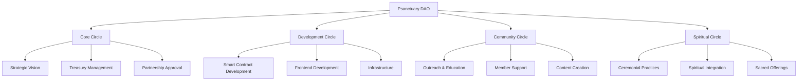
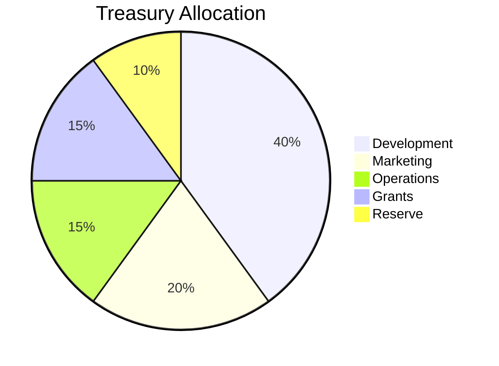

# DAO Governance Overview

## 🏛️ Decentralized Spiritual Governance

The **Psanctuary DAO** represents a new paradigm in spiritual organization—combining ancient wisdom with modern blockchain technology to create a truly decentralized, community-governed institution.

## 🎯 Core Principles

### 1. Distributed Authority
Power flows through **circles of responsibility**, not top-down hierarchies.

### 2. Earned Participation
Governance rights must be **earned through active engagement**, not just purchased.

### 3. Transparent Decision-Making
All proposals, votes, and treasury movements are **recorded on-chain** for complete transparency.

### 4. Holacratic Structure
Inspired by **holacracy**, we organize into autonomous circles with clear domains.

### 5. Spiritual Integration
Governance serves the **sacred mission** of healing, community, and spiritual growth.

## 🔄 The Holacracy Model

Traditional organizations have hierarchies. We have **circles**:



### Core Circle
**Domain:** Strategic direction and treasury stewardship

**Responsibilities:**
- Long-term vision and roadmap
- Major treasury allocations
- Partnership approvals
- Cross-circle coordination

**Membership:** Elected by MDAO holders

### Development Circle
**Domain:** Technical implementation and innovation

**Responsibilities:**
- Smart contract development
- Frontend/backend development
- Infrastructure management
- Security audits

**Membership:** Technical contributors with proven track record

### Community Circle
**Domain:** Outreach, education, and member support

**Responsibilities:**
- Community engagement
- Educational content
- Member onboarding
- Social media management

**Membership:** Active community members

### Spiritual Circle
**Domain:** Ceremonial practices and sacred integration

**Responsibilities:**
- Ceremonial design and facilitation
- Spiritual education
- Integration support
- Sacred space maintenance

**Membership:** Experienced practitioners and spiritual leaders

## 🗳️ Voting Mechanics

### MDAO Token: One Token, One Vote

```javascript
// Governance parameters
const PROPOSAL_THRESHOLD = 1000; // MDAO required to create proposal
const QUORUM = 100000; // 10% of total supply
const VOTING_PERIOD = 7 * 24 * 60 * 60; // 7 days
const EXECUTION_DELAY = 2 * 24 * 60 * 60; // 2 days (timelock)
```

### Proposal Lifecycle

1. **Creation** - Stake 1000 MDAO to create proposal
2. **Discussion** - 3-day discussion period
3. **Voting** - 7-day voting period
4. **Quorum Check** - Must reach 10% participation
5. **Timelock** - 2-day delay before execution
6. **Execution** - Proposal automatically executes if passed

### Proposal Types

#### Treasury Proposals
Allocate funds from the DAO treasury for:
- Development grants
- Marketing campaigns
- Partnership investments
- Community initiatives

#### Parameter Proposals
Adjust system parameters:
- Fee structures
- Token emission rates
- Staking rewards
- Governance thresholds

#### Upgrade Proposals
Modify smart contracts:
- Bug fixes
- Feature additions
- Security improvements
- Protocol upgrades

#### Partnership Proposals
Approve strategic partnerships:
- Integration with other protocols
- Collaboration agreements
- Joint ventures
- Sponsorships

## 💎 Earning MDAO

Unlike traditional governance tokens, MDAO must be **earned through participation**:

### 1. Staking PSILO
Lock PSILO tokens to earn MDAO over time:

```javascript
// Staking rewards formula
MDAO_per_day = (PSILO_staked / total_PSILO_staked) * daily_MDAO_emission
```

**Emission Schedule:**
- Year 1: 100,000 MDAO
- Year 2: 75,000 MDAO
- Year 3: 50,000 MDAO
- Year 4+: 25,000 MDAO annually

### 2. Active Voting
Earn bonus MDAO for consistent voting participation:

```javascript
// Voting rewards
if (votes_cast_this_month >= 5) {
  bonus_MDAO = 10;
}
```

### 3. Proposal Creation
Earn MDAO when your proposals pass:

```javascript
// Proposal rewards
if (proposal_passed && proposal_executed) {
  creator_reward = 100 MDAO;
}
```

### 4. Contribution Rewards
Community-approved work earns MDAO:

- Code contributions
- Documentation
- Design work
- Community support
- Educational content

### 5. Liquidity Mining
Provide ETHO/PSD liquidity to earn MDAO:

```javascript
// LP staking rewards
MDAO_per_day = (LP_tokens_staked / total_LP_staked) * LP_MDAO_emission
```

## 🔐 Security & Safety

### Timelock Contract
All governance actions have a **2-day delay** before execution, allowing the community to:
- Review the exact code that will execute
- Detect malicious proposals
- Emergency cancel if needed

### Multi-Sig Guardian
A **5-of-9 multi-sig** can veto proposals in emergency situations:
- Critical security vulnerabilities
- Malicious proposals
- Smart contract bugs

**Guardian Members:**
- 3 Core Circle members
- 2 Development Circle members
- 2 Community Circle members
- 2 Spiritual Circle members

### Proposal Validation
All proposals must pass validation checks:
- Proper formatting
- Valid smart contract calls
- Reasonable parameter ranges
- No malicious code patterns

## 📊 Treasury Management

### Treasury Composition

The DAO treasury holds:
- **30% of PSILO** - 3,000,000 tokens
- **30% of MDAO** - 300,000 tokens
- **ETH from crowdsale** - Fundraising proceeds
- **LP tokens** - ETHO/PSD liquidity positions
- **NFT holdings** - Rare SHROOM NFTs

### Allocation Strategy



### Spending Limits

To prevent treasury depletion:
- **Monthly limit:** 5% of treasury
- **Single proposal limit:** 2% of treasury
- **Emergency reserve:** 20% untouchable

## 🌟 Governance Best Practices

### For Proposal Creators

1. **Research thoroughly** - Understand the issue deeply
2. **Engage the community** - Discuss before proposing
3. **Write clearly** - Make the proposal easy to understand
4. **Provide context** - Explain why this matters
5. **Include details** - Specify exact implementation

### For Voters

1. **Read proposals carefully** - Don't just vote based on titles
2. **Participate in discussion** - Ask questions, share concerns
3. **Vote consistently** - Build your voting track record
4. **Think long-term** - Consider future implications
5. **Stay informed** - Follow DAO announcements

### For Circle Members

1. **Respect autonomy** - Let circles manage their domains
2. **Communicate clearly** - Share updates regularly
3. **Collaborate actively** - Work across circles
4. **Document decisions** - Keep transparent records
5. **Serve the mission** - Always prioritize the sacred purpose

## 🚀 Future Enhancements

### Quadratic Voting
Exploring **quadratic voting** to balance whale influence:

```javascript
// Quadratic voting formula
voting_power = sqrt(MDAO_balance)
```

### Delegation
Allow MDAO holders to **delegate voting power** to trusted representatives.

### Reputation System
Non-transferable **reputation tokens** that track contribution history.

### Conviction Voting
**Time-weighted voting** where longer commitment = more influence.

### Futarchy
**Prediction markets** to guide decision-making based on expected outcomes.

## 📚 Learn More

- **[MDAO Token Details](/docs/tokenomics/mdao-token)** - Deep dive into governance token
- **[Voting Tutorial](/docs/governance/voting-tutorial)** - Step-by-step voting guide
- **[Treasury Dashboard](/docs/governance/treasury)** - Real-time treasury analytics
- **[Proposal Templates](/docs/governance/proposal-templates)** - How to write proposals

---

*"In the circle, all voices are heard. In the DAO, all votes are counted. In the spirit, all are one."* 🍄✨

