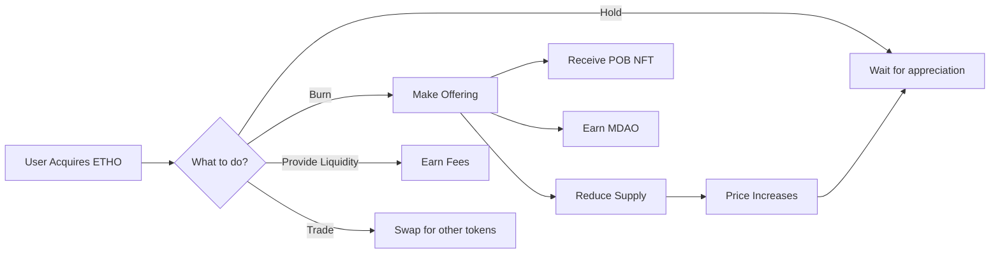

# ETHO Token - Ceremonial Burns

## 🔥 Overview

**ETHO** (Ethereal Token) is the **ceremonial burn token** at the heart of the Ethereal Offering ecosystem. It represents the sacred act of surrender, the offering of ego, and the transformation through sacrifice.

| Property | Value |
|----------|-------|
| **Symbol** | ETHO |
| **Type** | ERC-20 |
| **Initial Supply** | 100,000,000 (100M) |
| **Decimals** | 18 |
| **Supply Model** | Deflationary (burns reduce supply) |
| **Primary Use** | Ceremonial burns, AMM trading |

---

## 🕉️ Spiritual Significance

### The Burnt Offering

In ancient spiritual traditions, the **burnt offering** was a sacred act:

- **Surrender** - Releasing attachment to material things
- **Transformation** - Fire transforms matter into spirit
- **Gratitude** - Giving back to the Source
- **Purification** - Burning away the ego
- **Connection** - Joining heaven and earth

**ETHO burns are the digital equivalent of this ancient practice.**

### The Sacred Altar

When you burn ETHO at the Sacred Altar:

1. **Tokens are permanently destroyed** - Removed from circulation forever
2. **POB NFT is minted** - Soulbound receipt of your offering
3. **ETH donation goes to treasury** - Funds the mission
4. **Intention is recorded** - Your prayer/intention stored on-chain (encrypted)
5. **Community witnesses** - Your offering is seen and honored

**"The burnt offering teaches surrender. The feast teaches gratitude. Together they are worship: a life offered, a world received."**

---

## 💰 How to Acquire ETHO

### 1. Swap on AMM

Trade other tokens for ETHO:

- **ETHO/PSD Pool** - Primary trading pair (stablecoin)
- **ETHO/ETH Pool** - Secondary pair
- **ETHO/MDAO Pool** - Governance token pair

**Swap Fees:**
- 0.3% total fee
- 80% to treasury
- 20% to liquidity providers

### 2. Earn Through Participation

Receive ETHO rewards for:

- **Daily Check-ins** - 10 ETHO per day
- **Weekly Ceremonies** - 100 ETHO per ceremony
- **Monthly Milestones** - 500 ETHO per milestone
- **Referrals** - 50 ETHO per referral
- **Content Creation** - 100-1000 ETHO based on quality

### 3. Convert from Other Tokens

Swap your tokens for ETHO:

```
DM → ETHO (Daily rewards to ceremonial token)
MDAO → ETHO (Governance to offering)
PSILO → ETHO (Fundraising to ceremony)
```

### 4. Receive as Gifts

Community members can send you ETHO:

- **Gratitude gifts** - Thank someone with ETHO
- **Celebration gifts** - Honor milestones
- **Support gifts** - Help someone make an offering

---

## 🔥 Burning Mechanics

### The Sacred Altar Contract

```solidity
contract SacredAltar {
    /**
     * @notice Make a ceremonial offering
     * @param ethoAmount Amount of ETHO to burn
     * @param intention Encrypted prayer/intention (32 bytes)
     */
    function makeOffering(
        uint256 ethoAmount,
        bytes32 intention
    ) external payable {
        require(ethoAmount > 0, "Must burn ETHO");
        require(msg.value > 0, "Must donate ETH");
        
        // Burn ETHO tokens (permanent destruction)
        ethoToken.burnFrom(msg.sender, ethoAmount);
        
        // Mint POB NFT as receipt
        uint256 pobId = pobNFT.mint(msg.sender, ethoAmount, intention);
        
        // Route ETH to treasury
        treasury.deposit{value: msg.value}();
        
        emit OfferingMade(msg.sender, ethoAmount, pobId, intention);
    }
}
```

### Burn Tiers

Different burn amounts unlock different benefits:

| Tier | ETHO Amount | POB Rarity | MDAO Reward | Benefits |
|------|------------|-----------|-------------|----------|
| **Spark** | 1-99 | Common | 1 | Basic POB NFT |
| **Flame** | 100-999 | Uncommon | 10 | Animated POB NFT |
| **Blaze** | 1,000-9,999 | Rare | 50 | Special Discord role |
| **Inferno** | 10,000-99,999 | Epic | 200 | Featured on website |
| **Supernova** | 100,000+ | Legendary | 1,000 | Lifetime VIP status |

### Burn Frequency Bonuses

Regular burners get multipliers:

- **Daily Burner** (7 days streak): 1.1x MDAO
- **Weekly Burner** (4 weeks streak): 1.25x MDAO
- **Monthly Burner** (3 months streak): 1.5x MDAO
- **Quarterly Burner** (1 year streak): 2x MDAO
- **Eternal Flame** (2+ years streak): 3x MDAO

### Special Ceremony Days

Extra rewards on sacred days:

- **New Moon** - 2x MDAO rewards
- **Full Moon** - 2x MDAO rewards
- **Solstices** - 3x MDAO rewards
- **Equinoxes** - 3x MDAO rewards
- **Community Events** - Variable bonuses

---

## 📊 Deflationary Economics

### Supply Reduction

Every ETHO burn **permanently reduces** the total supply:

```
New Total Supply = Old Total Supply - Burned Amount
```

**Example:**
- Initial supply: 100,000,000 ETHO
- Community burns: 10,000,000 ETHO
- New supply: 90,000,000 ETHO
- **10% reduction in supply**

### Price Impact

As supply decreases, remaining ETHO becomes more valuable:

```
Price = Demand / Supply
```

**If demand stays constant:**
- Supply ↓ 10% → Price ↑ 11%
- Supply ↓ 25% → Price ↑ 33%
- Supply ↓ 50% → Price ↑ 100%

**This creates a positive feedback loop:**
1. Burns reduce supply
2. Price increases
3. Holders feel wealthier
4. More people want to participate
5. More burns happen
6. Cycle continues

### Burn Statistics

Track the burn rate:

- **Total Burned** - All-time ETHO destroyed
- **Burn Rate** - ETHO burned per day/week/month
- **Circulating Supply** - Remaining ETHO in circulation
- **Burn Percentage** - % of initial supply burned
- **Average Burn Size** - Typical offering amount

**View live stats:** [etherealoffering.org/stats](https://etherealoffering.org/stats)

---

## 🎨 Proof of Burn NFTs

### What is a POB NFT?

When you burn ETHO, you receive a **Proof of Burn (POB) NFT**:

- **Soulbound** - Cannot be transferred or sold
- **Permanent Record** - Immutable proof of your offering
- **Unique Artwork** - Generated based on burn amount and intention
- **Metadata** - Stores burn amount, date, intention hash
- **Rarity Tiers** - Common to Legendary based on amount

### NFT Artwork

POB NFTs feature **generative art** that reflects:

1. **Burn Amount** - Larger burns = more elaborate art
2. **Intention Energy** - Hash of intention affects colors
3. **Timing** - Moon phase and season influence design
4. **Streak** - Longer streaks add special effects
5. **Rarity** - Legendary burns get animated artwork

### Viewing Your POBs

See all your offerings:

1. Go to **"My NFTs"** → **"Proof of Burn"**
2. View gallery of all your POB NFTs
3. Click any NFT to see:
   - Burn amount
   - Date and time
   - Intention (if you choose to reveal)
   - Transaction hash
   - Rarity tier
   - MDAO earned

### POB Leaderboard

Top burners are honored:

- **All-Time Top Burners** - Lifetime total
- **Monthly Top Burners** - Current month
- **Longest Streaks** - Consecutive days
- **Largest Single Burn** - Biggest offering
- **Most Offerings** - Total number of burns

**Top 10 get special recognition on the website!**

---

## 🌊 Liquidity & Trading

### ETHO/PSD Pool

The primary trading pair:

- **Stablecoin Pair** - Less volatile, easier to value
- **Deep Liquidity** - $500K+ target liquidity
- **Low Slippage** - Trade large amounts efficiently
- **Fee Sharing** - LPs earn 20% of swap fees

**Provide Liquidity:**
1. Add equal value of ETHO and PSD
2. Receive LP tokens
3. Earn swap fees (0.06% per trade)
4. Earn MDAO rewards (5% APY)

### Price Discovery

ETHO price is determined by:

1. **Supply & Demand** - Market forces
2. **Burn Rate** - Higher burns = lower supply
3. **Utility** - More use cases = more demand
4. **Sentiment** - Community belief and momentum
5. **Market Conditions** - Overall crypto market

**Price Targets (Speculative):**

| Milestone | Target Price | Market Cap |
|-----------|-------------|-----------|
| Launch | $0.01 | $1M |
| 10% Burned | $0.02 | $1.8M |
| 25% Burned | $0.05 | $3.75M |
| 50% Burned | $0.15 | $7.5M |
| 75% Burned | $0.50 | $12.5M |

*Disclaimer: Speculative targets, not guarantees.*

---

## 🔄 Token Flows



---

## 🎯 Use Cases

### 1. Ceremonial Offerings

The primary use - burn ETHO as a spiritual practice:

- **Daily Practice** - Small daily burns
- **Weekly Ceremonies** - Larger weekly offerings
- **Special Occasions** - Major life events
- **Gratitude** - Thank the universe
- **Surrender** - Release attachments
- **Transformation** - Mark personal growth

### 2. Governance Participation

Burn ETHO to earn MDAO for voting:

- **Earn Voting Power** - Burns give MDAO
- **Demonstrate Commitment** - Skin in the game
- **Align Incentives** - Burners care about project
- **Reduce Supply** - Benefits all holders

### 3. Community Gifting

Send ETHO to others:

- **Thank Contributors** - Reward community members
- **Celebrate Milestones** - Honor achievements
- **Support Newcomers** - Help people participate
- **Random Acts of Kindness** - Spread joy

### 4. Trading & Speculation

Buy low, sell high:

- **Price Appreciation** - Deflationary pressure
- **Arbitrage** - Trade between pools
- **Liquidity Provision** - Earn fees
- **Long-term Hold** - Bet on project success

---

## 📈 Metrics & Analytics

### Key Metrics

**Supply Metrics:**
- Initial Supply: 100,000,000 ETHO
- Current Supply: [Check Contract]
- Total Burned: [Check Altar]
- Burn Percentage: [Burned / Initial]

**Price Metrics:**
- Current Price: [Check AMM]
- 24h Volume: [Check AMM]
- Market Cap: Price × Current Supply
- Fully Diluted Value: Price × Initial Supply

**Activity Metrics:**
- Daily Burns: [Check Altar]
- Average Burn Size: [Total / Count]
- Active Burners: [Unique addresses]
- Burn Frequency: [Burns per day]

**Holder Metrics:**
- Total Holders: [Check Etherscan]
- Top 10 Holders: [Check Etherscan]
- Distribution: [Gini coefficient]

---

## 🛡️ Security & Risks

### Smart Contract Security

- **Audited** - Professional security audit
- **Open Source** - Code publicly verifiable
- **Immutable** - No admin keys
- **Battle-Tested** - Based on OpenZeppelin

### Economic Risks

⚠️ **Important Risks:**

1. **Price Volatility** - ETHO price can fluctuate wildly
2. **Liquidity Risk** - May be hard to sell large amounts
3. **Burn Irreversibility** - Burned tokens are gone forever
4. **Smart Contract Risk** - Bugs could cause loss
5. **Market Risk** - Crypto market could crash

**Only burn what you can afford to lose.**

### Best Practices

✅ **Do:**
- Start with small burns
- Understand the mechanics
- Set intentions mindfully
- Track your offerings
- Participate regularly

❌ **Don't:**
- Burn more than you can afford
- Expect guaranteed returns
- Treat it as pure investment
- Ignore the spiritual aspect
- Rush into large burns

---

## 🔗 Resources

- **[Sacred Altar](https://etherealoffering.org/altar)** - Make offerings
- **[Swap ETHO](https://etherealoffering.org/swap)** - Trade tokens
- **[Provide Liquidity](https://etherealoffering.org/liquidity)** - Earn fees
- **[View POB NFTs](https://etherealoffering.org/nfts)** - See your offerings
- **[Burn Statistics](https://etherealoffering.org/stats)** - Track metrics
- **[Etherscan](https://etherscan.io/)** - Verify contract

---

*"What we offer to the fire, we receive as light. What we surrender in form, we reclaim as freedom."* 🔥✨

