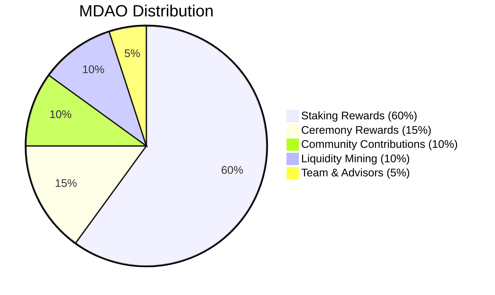

# MDAO Token - Governance & Voting

## 🗳️ Overview

**MDAO** (Mushroom DAO Token) is the **governance token** of the Ethereal Offering ecosystem. It grants holders the power to vote on proposals, shape the future of the platform, and participate in decentralized decision-making.

| Property | Value |
|----------|-------|
| **Symbol** | MDAO |
| **Type** | ERC-20 |
| **Total Supply** | 1,000,000 (1M) |
| **Decimals** | 18 |
| **Supply Model** | Fixed (no minting after deployment) |
| **Primary Use** | DAO governance, voting rights |

---

## 🎯 Purpose & Philosophy

### Why Separate Governance Token?

We use a **separate governance token** (MDAO) instead of using PSILO for governance because:

1. **Separation of Concerns** - Fundraising ≠ Governance
2. **Earned Influence** - Governance is earned through participation, not just purchased
3. **Long-term Alignment** - Stakers are committed to the project's success
4. **Sybil Resistance** - Harder to game the system
5. **Flexibility** - Can adjust governance without affecting fundraising

### Governance Philosophy

**"One token, one vote"** - but tokens must be **earned** through:
- Staking PSILO (commitment)
- Participating in ceremonies (engagement)
- Contributing to the community (service)
- Holding long-term (alignment)

---

## 💎 How to Earn MDAO

### 1. Stake PSILO Tokens

The primary way to earn MDAO is by **staking PSILO**:

```solidity
// Stake PSILO to earn MDAO
function stakePSILO(uint256 amount, uint256 lockPeriod) external {
    // Lock PSILO for 30 days to 4 years
    // Earn MDAO based on amount and duration
}
```

**Earning Rate:**
- **Base Rate:** 0.1 MDAO per PSILO per year (10% APY)
- **Lock Multipliers:**
  - 30 days: 1x (10% APY)
  - 90 days: 1.5x (15% APY)
  - 180 days: 2x (20% APY)
  - 1 year: 3x (30% APY)
  - 2 years: 4x (40% APY)
  - 4 years: 5x (50% APY)

**Example:**
- Stake 10,000 PSILO for 1 year
- Earn: 10,000 × 0.1 × 3 = 3,000 MDAO
- After 1 year, you have 3,000 MDAO voting power

### 2. Participate in Ceremonies

Earn MDAO by making offerings at the Sacred Altar:

- **Small Offering** (< 100 ETHO): 1 MDAO
- **Medium Offering** (100-1000 ETHO): 10 MDAO
- **Large Offering** (> 1000 ETHO): 50 MDAO
- **Mega Offering** (> 10,000 ETHO): 200 MDAO

**Bonus:** First offering of the month = 2x MDAO

### 3. Community Contributions

Earn MDAO for valuable contributions:

- **Bug Reports:** 10-100 MDAO (based on severity)
- **Code Contributions:** 50-500 MDAO (based on impact)
- **Content Creation:** 25-250 MDAO (blog posts, videos, tutorials)
- **Community Moderation:** 10 MDAO per week
- **Translation:** 100 MDAO per language
- **Partnership Referrals:** 500 MDAO per successful partnership

**How to Claim:**
1. Submit contribution proof to Discord
2. Community votes on reward amount
3. DAO approves payout
4. MDAO sent to your wallet

### 4. NFT Breeding

Earn MDAO by breeding rare Mushroom NFTs:

- **Common Offspring:** 1 MDAO
- **Uncommon Offspring:** 5 MDAO
- **Rare Offspring:** 25 MDAO
- **Epic Offspring:** 100 MDAO
- **Legendary Offspring:** 500 MDAO

**Bonus:** First legendary breed = 1,000 MDAO

### 5. Liquidity Provision

Earn MDAO by providing liquidity to AMM pools:

- **ETHO/PSD Pool:** 5% APY in MDAO
- **PSILO/ETH Pool:** 10% APY in MDAO
- **DM/PSD Pool:** 3% APY in MDAO

**Calculation:**
- Provide $10,000 liquidity to ETHO/PSD
- Earn: $10,000 × 5% = $500 worth of MDAO per year
- Plus swap fees (80% to treasury, 20% to LPs)

---

## 🗳️ Voting Mechanics

### Voting Power

Your voting power is determined by:

```
Voting Power = MDAO Balance × Time Multiplier
```

**Time Multiplier:**
- Held < 1 week: 0.5x
- Held 1-4 weeks: 1x
- Held 1-3 months: 1.5x
- Held 3-6 months: 2x
- Held 6-12 months: 3x
- Held > 12 months: 5x

**Why?** Rewards long-term holders and prevents vote buying.

### Proposal Types

#### 1. Standard Proposals
- **Quorum:** 10% of total MDAO supply
- **Threshold:** 51% approval
- **Voting Period:** 7 days
- **Timelock:** 48 hours

**Examples:**
- Adjust staking rewards
- Add new AMM pairs
- Update fee structures
- Marketing initiatives

#### 2. Major Proposals
- **Quorum:** 25% of total MDAO supply
- **Threshold:** 66% approval
- **Voting Period:** 14 days
- **Timelock:** 7 days

**Examples:**
- Treasury allocations > $100K
- Smart contract upgrades
- Partnership agreements
- Token economics changes

#### 3. Critical Proposals
- **Quorum:** 40% of total MDAO supply
- **Threshold:** 75% approval
- **Voting Period:** 21 days
- **Timelock:** 14 days

**Examples:**
- Constitution amendments
- Multi-sig signer changes
- Emergency actions
- Protocol migrations

### Delegation

Can't vote yourself? **Delegate** your voting power:

```solidity
// Delegate your MDAO voting power
function delegate(address delegatee) external {
    // Your MDAO still stays in your wallet
    // Delegatee can vote with your power
}
```

**Benefits:**
- Keep your tokens
- Support trusted community members
- Participate even when busy
- Can revoke anytime

**Popular Delegates:**
- @SpiritualSeeker (100K MDAO delegated)
- @CodeMonk (75K MDAO delegated)
- @MyceliumMage (50K MDAO delegated)

---

## 📊 Governance Process

### Step 1: Discussion Phase (3-7 days)

1. Post idea in Discord #governance channel
2. Community discusses and refines
3. Gather feedback and support
4. Revise based on input

### Step 2: Proposal Creation (1 day)

1. Write formal proposal with:
   - Title and summary
   - Detailed description
   - Rationale and benefits
   - Implementation plan
   - Budget (if applicable)
   - Success metrics
2. Submit on-chain (costs 100 MDAO deposit)
3. Proposal enters voting queue

### Step 3: Voting Period (7-21 days)

1. Proposal goes live for voting
2. MDAO holders vote Yes/No/Abstain
3. Votes are weighted by voting power
4. Real-time results visible

### Step 4: Timelock Period (48 hours - 14 days)

1. If proposal passes, enters timelock
2. Community can review final details
3. Emergency veto possible (requires 75% vote)
4. Gives time to prepare for changes

### Step 5: Execution

1. After timelock, proposal auto-executes
2. Smart contracts updated
3. Treasury funds released
4. Changes take effect

### Step 6: Post-Mortem (Optional)

1. Review proposal outcomes
2. Measure against success metrics
3. Learn and improve process
4. Share results with community

---

## 🏛️ DAO Structure

### Holacracy-Inspired Circles

The DAO is organized into **4 autonomous circles**:

#### 1. Core Circle
- **Focus:** Protocol development and security
- **Members:** Core developers, security auditors
- **Budget:** 40% of treasury
- **Voting:** Technical proposals

#### 2. Development Circle
- **Focus:** Feature development and integrations
- **Members:** Frontend devs, smart contract devs
- **Budget:** 30% of treasury
- **Voting:** Roadmap priorities

#### 3. Community Circle
- **Focus:** Growth, marketing, education
- **Members:** Community managers, content creators
- **Budget:** 20% of treasury
- **Voting:** Marketing initiatives

#### 4. Spiritual Circle
- **Focus:** Ceremonies, recovery programs, partnerships
- **Members:** Spiritual advisors, recovery leaders
- **Budget:** 10% of treasury
- **Voting:** Ceremonial and spiritual matters

**Each circle has autonomy within its domain but major decisions require full DAO vote.**

---

## 💰 Treasury Management

### Treasury Sources

The DAO treasury receives funds from:

1. **AMM Swap Fees** - 80% of all swap fees
2. **NFT Marketplace Fees** - 2.5% of all NFT sales
3. **Breeding Fees** - Paid in DM, converted to stablecoins
4. **Crowdsale Proceeds** - Initial PSILO sale
5. **Donations** - Community contributions
6. **Grants** - Nonprofit grants

### Treasury Allocation

| Category | Percentage | Purpose |
|----------|-----------|---------|
| Development | 40% | Smart contracts, frontend, infrastructure |
| Security | 15% | Audits, bug bounties, insurance |
| Marketing | 20% | Community growth, partnerships |
| Operations | 10% | Salaries, tools, services |
| Recovery Programs | 10% | Psychedelic therapy, scholarships |
| Reserve | 5% | Emergency fund |

### Multi-Sig Security

Treasury is controlled by **5-of-9 multi-sig**:

- 3 Core developers
- 2 Community representatives
- 2 Spiritual advisors
- 1 Legal counsel
- 1 Security expert

**All signers elected by MDAO holders.**

---

## 📈 MDAO Economics

### Supply Distribution



### Emission Schedule

| Year | Annual Emission | Cumulative Supply | % of Total |
|------|----------------|-------------------|-----------|
| 1 | 200,000 | 200,000 | 20% |
| 2 | 150,000 | 350,000 | 35% |
| 3 | 150,000 | 500,000 | 50% |
| 4 | 125,000 | 625,000 | 62.5% |
| 5 | 125,000 | 750,000 | 75% |
| 6-10 | 50,000/year | 1,000,000 | 100% |

**After 10 years, no more MDAO is minted.**

### Value Accrual

MDAO value comes from:

1. **Governance Rights** - Control over treasury and protocol
2. **Revenue Share** - Potential future dividends (requires vote)
3. **Scarcity** - Fixed supply, deflationary pressure
4. **Utility** - Required for proposals and voting
5. **Network Effects** - More users = more value

---

## 🔒 Security Features

### Vote Buying Prevention

- **Time-weighted voting** - Can't buy votes right before proposal
- **Delegation limits** - Max 10% of supply to one delegate
- **Proposal deposits** - 100 MDAO to prevent spam
- **Cooldown periods** - Must hold 1 week before voting

### Sybil Resistance

- **Staking requirement** - Must stake PSILO to earn MDAO
- **Proof of You** - Optional identity verification (Aleo ZK)
- **Reputation system** - Track voting history
- **Quadratic voting** - Optional for certain proposals

### Emergency Mechanisms

- **Pause function** - Multi-sig can pause in emergency
- **Veto power** - 75% vote can veto any proposal
- **Timelock bypass** - Only for critical security issues
- **Circuit breakers** - Auto-pause on suspicious activity

---

## 📚 Resources

- **[Stake PSILO](https://etherealoffering.org/stake)** - Earn MDAO
- **[Vote on Proposals](https://etherealoffering.org/governance)** - Participate in DAO
- **[Delegate Voting Power](https://etherealoffering.org/delegate)** - Support others
- **[Treasury Dashboard](https://etherealoffering.org/treasury)** - View finances
- **[Governance Forum](https://forum.psanctuary.org)** - Discuss proposals
- **[Discord #governance](https://discord.gg/psanctuary)** - Real-time chat

---

*"Governance is not control—it's stewardship. We don't own the DAO; we serve it."* 🍄✨

