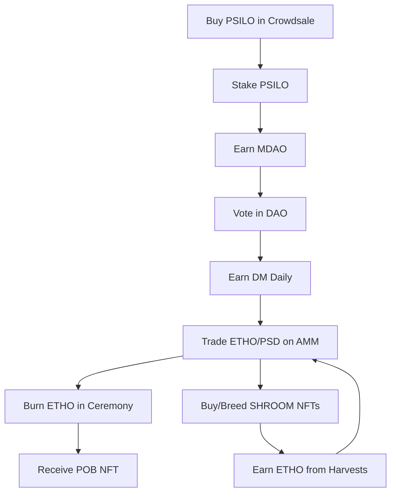

# Tokenomics Overview

## 🪙 Multi-Token Architecture

Ethereal Offering uses a sophisticated **multi-token architecture** designed to separate concerns and create a robust economic ecosystem. Each token serves a specific purpose, preventing conflicts and enabling clear utility.

## 📊 Token Summary

| Token | Symbol | Type | Primary Use | Supply Model |
|-------|--------|------|-------------|--------------|
| **Psanctuary Token** | PSILO | ERC-20 | Crowdsale fundraising | Fixed (10M) |
| **DAO Token** | MDAO | ERC-20 | Governance voting | Fixed (1M) |
| **Ethereal Token** | ETHO | ERC-20 | Ceremonial burns, AMM trading | Deflationary |
| **Psanctuary Dollar** | PSD | ERC-20 | Stablecoin (pegged to USD) | Elastic |
| **Daily Mushroom** | DM | ERC-20 | Daily claims, gas fees | Inflationary |
| **Proof of Burn** | POB | ERC-721 | Soulbound NFT receipts | Unlimited |
| **Mushroom NFT** | SHROOM | ERC-721 | Collectible genetics | Unlimited |

## 🎯 Design Principles

### 1. Separation of Concerns
Each token has **one clear purpose**, reducing complexity and preventing conflicts between different use cases.

### 2. Aligned Incentives
Rewards flow to **active participants** who contribute to the ecosystem, not just passive holders.

### 3. Sustainable Economics
Balanced **inflation and deflation** mechanisms ensure long-term economic health.

### 4. Community Ownership
The **DAO controls** treasury and parameters, ensuring decentralized governance.

### 5. Spiritual Integration
Economics serve the **sacred mission** of healing, community, and spiritual growth.

## 🌊 Economic Flow

Here's how the tokens work together in the ecosystem:

## 💡 Key Concepts

### Deflationary Pressure
ETHO tokens are **permanently burned** in ceremonies, reducing total supply and creating scarcity.

### Inflationary Rewards
DM tokens are **minted daily** to reward active participation, encouraging engagement.

### Stable Value
PSD maintains a **1:1 peg with USD** through over-collateralization and algorithmic adjustments.

### Earned Governance
MDAO tokens must be **earned through participation**, not just purchased, ensuring engaged governance.

### Soulbound Records
POB NFTs are **non-transferable**, creating permanent records of spiritual offerings.

## 🚀 Getting Started

1. **[PSILO Token](./psilo-token)** - Learn about the crowdsale and initial fundraising
2. **[MDAO Token](./mdao-token)** - Understand governance and voting rights
3. **[ETHO Token](./etho-token)** - Explore ceremonial burning and trading
4. **[PSD Stablecoin](./psd-stablecoin)** - Discover stable value in crypto
5. **[DM Token](./dm-token)** - Daily rewards and participation incentives
6. **[NFT Ecosystem](./nft-ecosystem)** - POB and SHROOM NFTs explained

## 📈 Economic Sustainability

Our token economy is designed for **long-term sustainability**:

- **Treasury Management** - DAO-controlled funds for development and operations
- **Liquidity Pools** - Deep liquidity for stable trading
- **Burn Mechanisms** - Deflationary pressure on ETHO
- **Participation Rewards** - Incentives for active community members
- **Stable Value** - PSD provides price stability
- **Multiple Revenue Streams** - Trading fees, NFT sales, crowdsale proceeds

## 🌟 Future Enhancements

As the ecosystem evolves, we're exploring:

- **Yield Farming** - Stake LP tokens to earn MDAO
- **NFT Staking** - Lock SHROOM NFTs for passive income
- **Cross-Chain Bridges** - Expand to other blockchains
- **Advanced Stability** - Improved PSD peg mechanisms
- **Reputation System** - Non-transferable reputation tokens
- **Algorithmic Treasury** - Automated treasury management

## 📚 Learn More

- **[Token Economics Blog Post](/blog/token-economics-multi-token-architecture)** - Deep dive into the architecture
- **[Whitepaper](/docs/whitepaper/introduction)** - Complete project vision
- **[DAO Governance](/docs/governance/overview)** - How decisions are made
- **[NFT Ecosystem](/docs/nfts/overview)** - Mushroom NFTs and breeding

---

*"In the garden of abundance, every token is a seed. Plant wisely, tend carefully, and watch the forest grow."* 🍄✨

