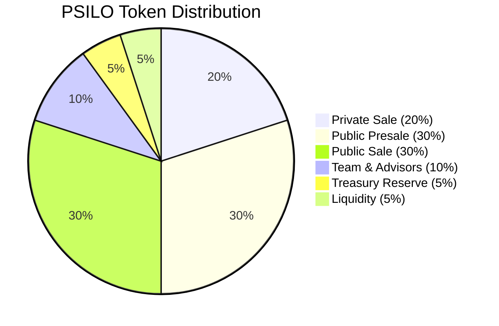
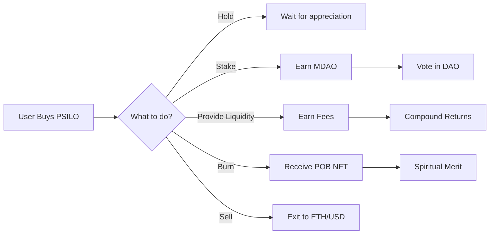

# PSILO Token - Crowdsale & Fundraising

## 🍄 Overview

**PSILO** (Psanctuary Token) is the **primary fundraising token** for the Ethereal Offering ecosystem. It represents early support and belief in the mission of Psanctuary Church.

| Property | Value |
|----------|-------|
| **Symbol** | PSILO |
| **Type** | ERC-20 |
| **Total Supply** | 10,000,000 (10M) |
| **Decimals** | 18 |
| **Supply Model** | Fixed (no minting after deployment) |
| **Primary Use** | Crowdsale fundraising, early supporter rewards |

---

## 💰 Crowdsale Mechanics

### Phases

#### Phase 1: Private Sale (20% - 2M tokens)
- **Price**: $0.10 per PSILO
- **Minimum**: 10,000 PSILO ($1,000)
- **Bonus**: 20% bonus tokens
- **Vesting**: 6-month cliff, 12-month linear vest
- **Target Raise**: $200,000

**Eligibility:**
- Early supporters and believers
- Strategic partners
- Recovery community leaders
- Spiritual advisors

#### Phase 2: Public Presale (30% - 3M tokens)
- **Price**: $0.15 per PSILO
- **Minimum**: 1,000 PSILO ($150)
- **Bonus**: 10% bonus tokens
- **Vesting**: 3-month cliff, 6-month linear vest
- **Target Raise**: $450,000

**Eligibility:**
- Open to all participants
- Whitelist via Discord/Telegram
- KYC not required (pseudonymous OK)

#### Phase 3: Public Sale (30% - 3M tokens)
- **Price**: $0.25 per PSILO
- **Minimum**: 100 PSILO ($25)
- **Bonus**: None
- **Vesting**: No vesting (immediate liquidity)
- **Target Raise**: $750,000

**Eligibility:**
- Fully public
- No whitelist required
- First-come, first-served

### Token Allocation



| Allocation | Percentage | Amount | Vesting |
|------------|-----------|--------|---------|
| Private Sale | 20% | 2,000,000 | 6mo cliff + 12mo vest |
| Public Presale | 30% | 3,000,000 | 3mo cliff + 6mo vest |
| Public Sale | 30% | 3,000,000 | No vesting |
| Team & Advisors | 10% | 1,000,000 | 12mo cliff + 24mo vest |
| Treasury Reserve | 5% | 500,000 | DAO controlled |
| Liquidity Pool | 5% | 500,000 | Locked 12 months |

---

## 🎯 Use Cases

### 1. Fundraising
The primary purpose of PSILO is to **raise capital** for:

- **Smart Contract Development** - Audit fees, developer salaries
- **Infrastructure** - Servers, domains, cloud services
- **Marketing** - Community building, partnerships
- **Legal** - Entity formation, compliance
- **Operations** - Day-to-day expenses

### 2. Governance Rights
PSILO holders can **vote on early decisions**:

- Roadmap priorities
- Partnership approvals
- Treasury allocations
- Team hiring

**Note:** For ongoing governance, PSILO can be staked to earn MDAO tokens (see [MDAO Token](/docs/tokenomics/mdao-token)).

### 3. Staking for MDAO
Convert PSILO into governance power:

```solidity
// Stake PSILO to earn MDAO
function stakePSILO(uint256 amount) external {
    // Lock PSILO for 30 days minimum
    // Earn MDAO at rate of 0.1 MDAO per PSILO per year
}
```

**Staking Rewards:**
- **Rate**: 0.1 MDAO per PSILO per year (10% APY in MDAO)
- **Minimum Lock**: 30 days
- **Maximum Lock**: 4 years (4x multiplier)
- **Early Withdrawal**: 25% penalty (goes to treasury)

### 4. Liquidity Provision
Provide liquidity to earn fees:

- **PSILO/ETH Pool** - Primary liquidity pair
- **Fee Share**: 20% of swap fees (80% to treasury)
- **LP Tokens**: Tradeable, stakeable
- **Impermanent Loss**: Risk of price divergence

### 5. Ceremonial Burns
Burn PSILO as an offering:

- **Voluntary Sacrifice** - Reduce circulating supply
- **POB NFT Receipt** - Receive soulbound NFT
- **Treasury Benefit** - Increases value for remaining holders
- **Spiritual Significance** - Act of surrender and trust

---

## 📈 Economic Model

### Supply Dynamics

**Fixed Supply:**
- No new PSILO can ever be minted
- Supply only decreases through burns
- Deflationary pressure over time

**Circulating Supply Schedule:**

| Month | Circulating Supply | % of Total |
|-------|-------------------|-----------|
| 0 (Launch) | 3,000,000 | 30% |
| 3 | 4,500,000 | 45% |
| 6 | 6,500,000 | 65% |
| 12 | 8,500,000 | 85% |
| 24 | 9,500,000 | 95% |
| 36 | 10,000,000 | 100% |

### Price Discovery

**Initial Price:** $0.10 - $0.25 (depending on sale phase)

**Price Drivers:**
- **Demand** - More buyers = higher price
- **Utility** - Staking, governance, burns
- **Scarcity** - Fixed supply + burns
- **Market Sentiment** - Crypto market conditions
- **Project Success** - Adoption and growth

**Price Targets (Speculative):**

| Milestone | Target Price | Market Cap |
|-----------|-------------|-----------|
| Launch | $0.25 | $2.5M |
| 1,000 Users | $0.50 | $5M |
| 10,000 Users | $1.00 | $10M |
| 100,000 Users | $5.00 | $50M |
| 1M Users | $25.00 | $250M |

**Disclaimer:** These are speculative targets, not guarantees. Crypto markets are volatile. Only invest what you can afford to lose.

---

## 🔄 Token Flows



---

## 🛡️ Security & Compliance

### Smart Contract Security
- **Audited** - Professional security audit by [Auditor Name]
- **Open Source** - Code publicly verifiable on Etherscan
- **Immutable** - No admin keys, no upgrades
- **Standard** - OpenZeppelin ERC-20 implementation

### Regulatory Considerations
- **Utility Token** - Not a security (legal opinion obtained)
- **No Profit Promises** - We make no guarantees of returns
- **Decentralized** - No central control after launch
- **Nonprofit Mission** - Psanctuary Church is a 501(c)(3) (pending)

### Risk Disclosures
⚠️ **Important Risks:**

1. **Smart Contract Risk** - Bugs could lead to loss of funds
2. **Market Risk** - Price could go to zero
3. **Regulatory Risk** - Laws could change
4. **Liquidity Risk** - May be hard to sell
5. **Project Risk** - Team could fail to deliver

**Only invest what you can afford to lose.**

---

## 📊 Metrics & Analytics

### Key Metrics to Track

**Supply Metrics:**
- Total Supply: 10,000,000 PSILO
- Circulating Supply: [Check Etherscan]
- Burned Supply: [Check Altar Contract]
- Staked Supply: [Check Staking Contract]

**Price Metrics:**
- Current Price: [Check DEX]
- 24h Volume: [Check DEX]
- Market Cap: Price × Circulating Supply
- Fully Diluted Valuation: Price × Total Supply

**Holder Metrics:**
- Total Holders: [Check Etherscan]
- Top 10 Holders: [Check Etherscan]
- Distribution: [Gini coefficient]

**Activity Metrics:**
- Daily Transactions: [Check Etherscan]
- Daily Active Users: [Check Etherscan]
- Staking Ratio: Staked / Circulating
- Burn Rate: Burned / Month

---

## 🎁 Bonus Programs

### Early Supporter Bonuses

**Private Sale:**
- 20% bonus tokens
- Exclusive Discord role
- Early access to features
- Lifetime fee discounts

**Public Presale:**
- 10% bonus tokens
- Priority support
- Beta testing access

### Referral Program

Refer friends and earn:
- **5% of their purchase** in PSILO
- **Unlimited referrals** - no cap
- **Instant credit** - receive immediately
- **Trackable links** - unique referral code

### Loyalty Rewards

Hold PSILO for rewards:
- **30 days**: Bronze tier (5% staking boost)
- **90 days**: Silver tier (10% staking boost)
- **180 days**: Gold tier (15% staking boost)
- **365 days**: Platinum tier (25% staking boost)

---

## 🔗 Contract Addresses

### Mainnet (Ethereum)
- **PSILO Token**: `0x...` (Coming Soon)
- **Crowdsale Contract**: `0x...` (Coming Soon)
- **Staking Contract**: `0x...` (Coming Soon)

### Testnet (Sepolia)
- **PSILO Token**: `0x...` (Available Now)
- **Crowdsale Contract**: `0x...` (Available Now)
- **Staking Contract**: `0x...` (Available Now)

---

## 📚 Resources

- **[Buy PSILO](https://etherealoffering.org/crowdsale)** - Participate in the sale
- **[Stake PSILO](https://etherealoffering.org/stake)** - Earn MDAO rewards
- **[Etherscan](https://etherscan.io/token/0x...)** - View contract
- **[Uniswap](https://app.uniswap.org/)** - Trade PSILO
- **[Discord](https://discord.gg/psanctuary)** - Join community
- **[Whitepaper](/docs/whitepaper/introduction)** - Read full vision

---

*"PSILO is not just a token—it's a seed. Plant it in the soil of your faith, water it with your participation, and watch the mycelium grow."* 🍄✨

