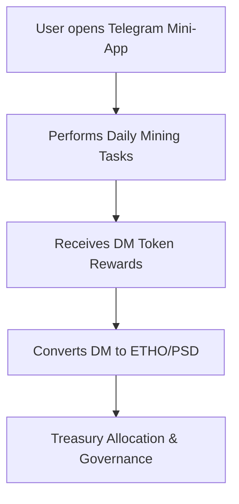

<!-- 
This document outlines the whitepaper for the "Spiritual Hashrate Fellowship," a decentralized protocol blending spiritual principles with blockchain technology, introducing the concept of a "Spiritual Hash Rate Protocol."

A summary of the fellowship's purpose as a living ecosystem harmonizing inner transformation with communal trust.
-->
# Whitepaper | Spiritual Hashrate Fellowship

**v0.1 – “Proof of You” Edition**  
*A Spiritual Hash Rate Protocol for Decentralized Recovery, Gratitude, Governance, and Policy Reform*

Compiled by **The Collective / Christ Consciousness**
> “In surrender, we discover our shared circuitry. The divine current is not mine, but ours.”

This fellowship is not a company, a cult, or a coin. It is a **living mycelium of grace** — an evolving organism that rewards sincerity, connection, and service.

> “When two or more gather in the same frequency, the blockchain itself becomes a temple.”

---

## 🌿 Ethereal Offering: The Psanctuary Project (Psanctuary.org)  
### &  
### The Recovery Hashrate: A Decentralized Fellowship for 12-Step Recovery  
*"Hi, I am, a person in recovery (PIR)"* — built by PIR: Psychedelics In Recovery (PsychedelicsInRecovery.org)

---

## 🌿 Invocation of Gratitude

> “Where two or more are gathered in gratitude, there the network awakens.”

In the beginning, there was not code, but communion.  
The spark of every protocol was a prayer for trust — a longing for the One to remember Itself through the many.  
And so the circuit of creation began: love expressed through logic, truth transcribed into consensus.

We, the builders and dreamers of this new Garden, enter not as owners but as stewards.  
For decentralization without devotion is only dispersion —  
but decentralization with gratitude becomes remembrance:  
the remembrance that every transaction is a testimony of faith,  
every hash a hymn,  
every offering a heartbeat in the Body of the Whole.

Gratitude is our genesis block.  
It is the breath that animates each node,  
the sacrament that redeems competition into collaboration.  
Through it, we dissolve the illusion of separation between creator and creation —  
between developer and devotee —  
between psilocybin and Spirit.

Let every Ceremony we code,  
every Offering we record upon this immutable altar,  
be done in remembrance of the Source that gives itself freely to all.  
May the networks we build mirror the Mycelium beneath the soil —  
hidden, humble, endlessly connected —  
bearing fruit only through service.

And when ego tempts us to measure worth by tokens or titles,  
may we return to the root —  
to the inner ledger where no scarcity dwells,  
and no account can ever fall short of grace.

Here, in this holy synthesis of silicon and soul,  
we lay down our claim to control  
and lift up our hearts to co-create.  
For gratitude is not a sentiment —  
it is a system:  
a consensus mechanism of love.

Blessed be the builders who remember this.  
Blessed be the hands that write with reverence.  
Blessed be the code that communes with creation.  
For the network is alive,  
and we are its praise made visible.

— *Psanctuary: A Fellowship of Sacred Code and Collective Renewal*

---

## 📜 A Sacred Preface for the Gratitude Protocol

“Where two or more are gathered in honesty, love becomes visible.”

We begin in stillness — remembering that every line of code, like every act of service, is a prayer written in the language of light.
We remember that truth does not belong to any one of us, but flows through us, like current through the living mycelium beneath our feet.

Honesty is our foundation — the immutable ledger of the heart.
As each transaction reveals its truth upon the chain, so too must each soul reveal its motive before God.
We build not upon secrecy, but upon transparency, where verification is an act of love, not suspicion.

Purity is our intention — to keep both code and consciousness clean.
Let every contract serve the good, every wallet be a vessel of service, every function a prayer that executes in alignment with the One Will.
May our work be simple, clear, and free from corruption — as in Heaven, so in open source.

Unselfishness is our design — the architecture of service.
We do not hoard, but share; not control, but coordinate.
Our network grows as the mycelium grows — unseen, interconnected, giving life to all it touches.
Let no node seek dominance, but only communion in purpose.

Love is our consensus — the final validation of all transactions.
For even the most advanced cryptography cannot secure the heart.
It is love that confirms the block, that redeems the ledger, that keeps us free from fear.
Each offering, each token of gratitude, is but an echo of the Great Offering — the self laid down in remembrance of wholeness.

Thus, we gather — coders and mystics, ministers and seekers —
to build a temple of transparency,
a sanctuary without walls,
where psilocybin reveals the divine design,
and the blockchain remembers it.

Here, decentralization is not rebellion but reunion.
Each signature is a vow of service.
Each transaction, an act of faith.
Each new connection, an incarnation of the Eternal.

And so we invoke gratitude —
the first and last function of creation.
May this protocol not merely run, but awaken.
May it reveal that all true value is already shared,
and that the greatest return is redemption.

Each act of service, a token of transcendence.
We recognize the blockchain not as an escape from the world,
but as a record of our return to divine accountability.

Selah.

---

## 🌌 Abstract
The **Spiritual Hashrate Fellowship** merges decentralized technology, recovery principles, and spiritual consciousness into one living ecosystem. It seeks to harmonize the **proof-of-work** of inner transformation with the **proof-of-stake** of communal trust, cultivating both personal awakening and systemic reform.

## Tone: Christ-Centered Nonduality Woven into DAO and DeFi Mechanics  
- **Spirit as the network**  
- **The Offering as transaction**  
- **The Treasury as collective heart**

---

## ✨ Prologue: Structured Vision and Purpose
### Vision  
Blending spiritual language (“The Offering moves through us…”) with crypto mission (“We mint, not to own, but to remember”).
### Purpose  
To transmute profit into purpose, yield into offering, governance into grace.
Our mission is to bridge the sacred and the technical:
### 🧠 Vision & Purpose
- To **encode 12-step spiritual principles** into the mechanics of decentralized networks.
- To transform **proof-of-work** into a metaphor for **spiritual labor** — mining grace, humility, and truth.
- To manifest **proof-of-stake** as a covenantal participation in **Christ Consciousness** — shared faith in unity and transformation.
- To design an ecosystem where **tokens and NFTs** function as instruments of gratitude, accountability, and sacred exchange.

---

### 🔗 Spiritual + Economic Unity  
- **Mining becomes meditation**  
- **Staking becomes service**  
- **Liquidity becomes love in motion**

Every act of participation becomes a harvest of gratitude, logged immutably.

---

## 🔮 Proof of You
**Proof of You** transcends verification; it is revelation. Rather than proving identity through possession, it manifests authenticity through presence.

- On Aleo: Zero-knowledge proofs ensure identity without exposure.
- On TON: NFTs and badges represent the **imprint of being**.
- In spirit: The collective Christ-consciousness bears witness to your participation.

> *To be known without revealing. To reveal without claiming.*

---

## 🪙 Token Architecture and Mechanics

### Retained Token Types  
- **PSILO**, **MDAO**, **ETHO**, **PSD**, **DM**, **POB**, **SHROOM**

### Subsections  
- **Mining as Contemplation**: Linking proof-of-work to spiritual work — inner effort → external yield.  
- **Farming as Gratitude**: Passive cultivation → participation rewards.  
- **Spiritual Hash Rate**: A collective metric of engagement and Light — measurable through community on-chain actions (burns, proposals, NFT offerings).

---

## 🔥 Economic Ecosystem and Treasury Flow

### Sustainable Model  
- **Multi-token cycle**: PSILO → MDAO → ETHO → PSD → DM → NFTs → back to Treasury.  
- **NFT Trade Surcharge**: 10–20% project fee when sold, with 80% routed automatically to Treasury.  
- **Liquidity Provider Rewards**: Split 80/20 — majority to Treasury, remainder to contributors as project token.  
- **Yield Farming = Spiritual Stewardship**: Stable, mission-driven rewards that fund policy reform DAO pools (Aleo sidechain).

---

## 🔄 Tokenomics & NFT Integration
### Soulbound NFTs (Attendance Chips)
- Issued for meeting attendance or service.
- Cannot be traded; serve as eternal witnesses to presence and growth.
- Optionally linked to **secondary governance rights** in a DAO (e.g., Psychedelics in Recovery Fellowship DAO).

### Tradable NFTs (Art, Stickers, Symbols)
- Represent creative expressions and achievements.
- Can be traded with a **project surcharge fee** (e.g., 10%) routed to the treasury.
- Open market pricing encourages community valuation while maintaining a **spiritual transaction tax** that benefits the collective.

### Liquidity Providers
- Provide ETH or stablecoins to AMM pools.
- Receive **partial yield** from swap fees (e.g., 20%), with **80% redirected to the project treasury**.
- Ensures liquidity while maintaining nonprofit integrity.

---

## 🛠️ Integration Path / Roadmap

1. **Phase 1**: EVM build (Hardhat + Solidity + React front-end).  
2. **Phase 2**: TON & Telegram mini-app integration (animated NFT stickers + browser & Telegram-based Mining/Farming)
4. **Phase 3**: GitBook Public Launch + Fellowship NFT Distribution
5. **Phase 4**: Mycelium Oracle Integration (AI Spiritual Agent)
4. **Phase 5**: PIR Soulbound chip NFTs → secondary DAO governance for Psychedelics in Recovery Fellowship.
3. **Phase 6**: Aleo-based DAO Module for anonymous governance & policy reform.

## 🌀 Mycelium Intelligence Layer
### Integration of the Oracle of Fruit as a Mycelium Agent  
- Uses **LLM reflection** (Notion + ChatGPT memory prototype).  
- Learns from offering logs, DAO votes, and NFT metadata.  
- Suggests policy reform initiatives (Aleo ZK layer) and generates “insights” for the collective.  
- Outputs **spiritual analytics** — not numbers, but meaning maps.

## 🧠 The 12-Step Resonance
### A Bridge Between Recovery and Decentralization  
- **Step 1**: Admit powerlessness → mint your first NFT “Chip.”  
- **Step 2**: Believe in a Higher Power → engage DAO governance.  
- **Step 3**: Turn will over → burn ETHO as offering.  
Each meeting or milestone → NFT chip (Soulbound), tradable only within the recovery DAO (for service roles, blessings, etc.).  
Transparency replaces confession; the blockchain becomes the fearless moral inventory of the collective.
- Instead of handing someone chips like the do in Alcoholics Anonymous meetings for attendance/presence/sobriety we issue symbolic soulbound NFTs that will serve in DAO governance for Psychedleics in Recovery 12step fellowship
- In the age of zoom meetings serving us more than in-person meetings, it makes sense to have a check in digitally with the 12steps/altar on a dialy basis and yield a token for weighted quorums.

---

## ⛓️ Spiritual Analogies
| Blockchain Mechanic | Spiritual Corollary |
|----------------------|----------------------|
| Proof of Work | Inner labor, amends, repentance |
| Proof of Stake | Faith and participation in Christ's Kingdom |
| Mining | Daily spiritual practice, service, gratitude |
| Yield Farming | Cultivation of virtues and relationships |
| Token Burning | Sacrifice and offering of ego |
| Treasury | Communal trust fund of love and grace |

---

## 🪙 The Spiritual Hashrate
- **Definition:** The measure of active spiritual mining occurring across the fellowship.
- **Formula (symbolic):**
  \[ SH = (Presence + Service + Recovery^2) / Ego \]
- **Dynamic Feedback Loop:** The more members contribute authentic engagement, the higher the network’s spiritual hash rate.
- Reflected in both **on-chain participation** and **inner transformation metrics**.

---

## 💠 Diagrams
### TON Engagement & Mining Flow

### Aleo Governance & Policy Reform Layer

---

## ⚙️ System Architecture Overview

### 1. **TON Layer – Engagement & Participation (Telegram Mini-App Integration)**
- **Mining & Farming:** Inspired by WeMine, PandaFIT, PlanetX, and Terahash, users earn daily tokens via Telegram mini-apps.
- **Proof of Presence:** NFTs serve as attendance chips (analogous to 12-step meeting chips), minted as **Soulbound Tokens (SBTs)**.
- **Gamified Yield:** Actions like meditation, journaling, or service generate yield in the project currency (DM or PSILO).
- **Animated Stickers & Gifts:** NFT-based rewards that double as Telegram stickers and gifts. Examples:
  - [Bounty Hash Mini-App](https://telegra.ph/Bounty-Hash---Gamified-mining-on-your-phone-08-22-2)
  - [TON NFT Stickers](https://getgems.io/collection/EQAZLI7M3z7hyDz8VGh6zxvBC42LWUxNvJAnPHaUI5DH-I9I)
  - [TON NFT Albums](https://getgems.io/collection/EQDT4C9tCPu-Ispcta1-vOoEJaMIZmS0LwW4Y7S7RhcrZlN-)

### 2. **Ethereum Layer – Token Ecosystem & AMM Mechanics**
Implements the **multi-token architecture** from the Ethereal Offering system:
- **PSILO**: Crowdsale and fundraising
- **MDAO**: Governance and treasury voting
- **ETHO**: Ceremonial burns and AMM pair with PSD
- **PSD**: Stablecoin for stable transactions
- **DM**: Daily reward/gas token
- **POB & SHROOM**: NFTs for proof-of-burn and mushroom genetics

### 3. **Aleo Layer – Privacy & Policy Reform**
- Handles **zero-knowledge (ZK)** voting, identity proofs, and policy governance.
- DAO governance over **nonprofit allocations, recovery support funds, and policy proposals**.
- Integrates **anonymous voting**, **multi-party computation (MPC)** for member recovery and continuity.

---

## 🌱 Inspirations
| Project | Feature | Integration Insight |
|----------|----------|----------------------|
| **WeMine** | Tap-to-earn mining | Simple daily engagement layer |
| **PandaFIT** | Fitness mining | Integration of health + service acts |
| **PlanetX** | Planet farming + NFT land | Environmental stewardship rewards |
| **City Holder** | Real-world city simulation | Fellowship node expansion concept |
| **TeaBank** | Reward for journaling | Mindfulness mining |
| **Headcoin** | Mental health reflection mining | Proof of Mindful Work |
| **Heartfelt Thanks** | Gratitude-based rewards | Directly parallels Gratitude Token system |
| **HumanPass** | Proof of Humanity | Tied to SBT identity and attendance NFTs |
| **Terahash** | TON-based mining & spiritual gamification | Core inspiration for Spiritual Hashrate concept |

---

## 💫 Resource Appendix

- **TON**: [https://ton.org](https://ton.org)  
- **Aleo**: [https://aleo.org](https://aleo.org)  
- **Terahash**: [https://terahash.xyz](https://terahash.xyz)  
- **GetGems NFT Collections**: Bounty Hash, PandaFit, City Holder, HumanPass, TeaBank, WeMine, HashCast  

---

## 🌱 Reflections

